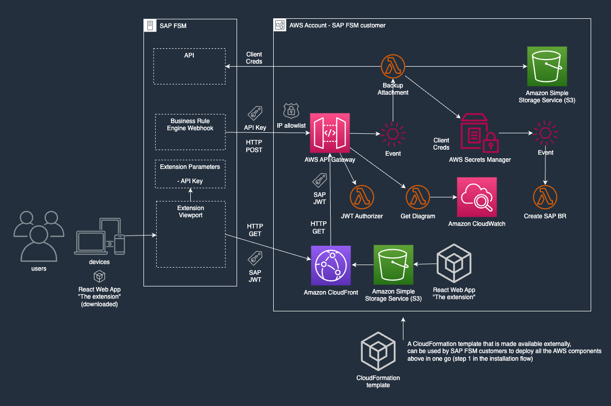
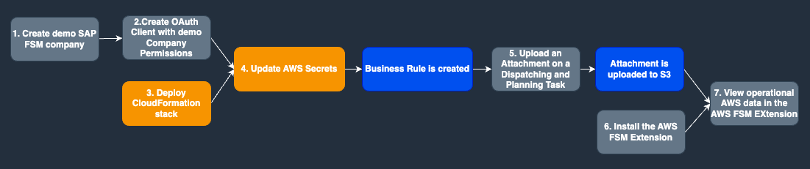
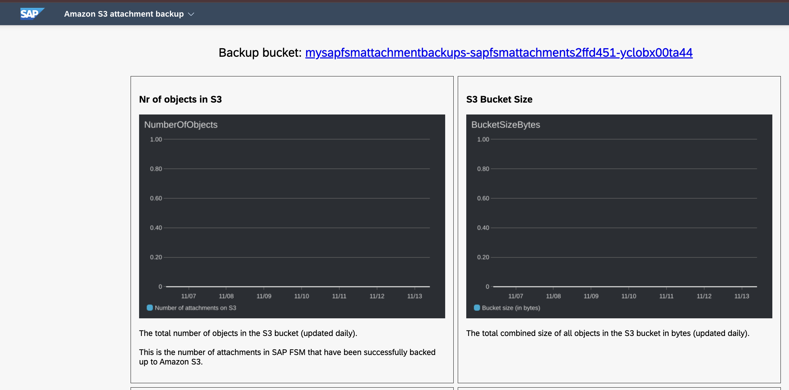

# Amazon Web Services and SAP Field Service Management Integration Sample

This is an [AWS CDK](https://aws.amazon.com/cdk/) project that demonstrates how to integrate SAP Field Service Management (FSM) with AWS.

Specifically, the project here will back up attachments as they are created in SAP FSM, to Amazon S3. To this end it includes an incoming webhook (AWS API Gateway REST) that will be invoked by a SAP FSM business rule to execute backups, and a sample User Interface that can be installed as a SAP FSM extension. The User Interface allows SAP FSM admins to view Amazon CloudWatch metrics about the S3 backups, such as object count, bucket size, errors (if any), from inside the SAP FSM application--thus offering a seamless integration between SAP FSM and AWS.

This project can also be used as a reference implementation for building other integrations between SAP FSM and AWS.

**IMPORTANT** Users of this solution are advised that this is _**sample code intended for demonstration purposes**_. Users should review the code, and apply their own judgement on its security posture, and add any additional security safeguards as they deem necessary. Also, see the [Security considerations](#security-considerations) below.

## Architecture

## Installation and testing procedure

The diagram below outlines the installation and testing procedure.

### Explanation

#### 1. Create demo SAP FSM Company Client Application

Using the SAP Admin page first create a new Company and set it's type to demo so that it will be populated with sample data.

#### 2. Create OAuth Client with demo Company Permissions

Then for your account choose Clients, create a new client, configure it for the new demo company, and set the `Authentication Type` to `Client Secret`. (Note. take a record of the Client ID and Client Secret as you will need this in a subsequent step).

#### 3. Deploy CloudFormation Stack

It is suggested to create the AWS infrastructure using a **Quick Create Stack link** for your AWS region of choice:

- [eu-central-1](https://eu-central-1.console.aws.amazon.com/cloudformation/home#/stacks/quickcreate?stackName=MySapFsmAttachmentBackupStack&templateURL=https://cf-templates-736744502971-eu-central-1.s3.amazonaws.com/SapFsmAttachmentBackupStack.template.json)
- [eu-west-1](https:/eu-west-1.console.aws.amazon.com/cloudformation/home#/stacks/quickcreate?stackName=MySapFsmAttachmentBackupStack&templateURL=https://cf-templates-736744502971-eu-west-1.s3.amazonaws.com/SapFsmAttachmentBackupStack.template.json)
- [us-east-1](https://us-east-1.console.aws.amazon.com/cloudformation/home#/stacks/quickcreate?stackName=MySapFsmAttachmentBackupStack&templateURL=https://cf-templates-736744502971-us-east-1.s3.amazonaws.com/SapFsmAttachmentBackupStack.template.json)
- [ap-southeast-2](https://ap-southeast-2.console.aws.amazon.com/cloudformation/home#/stacks/quickcreate?stackName=MySapFsmAttachmentBackupStack&templateURL=https://cf-templates-736744502971-ap-southeast-2.s3.amazonaws.com/SapFsmAttachmentBackupStack.template.json)

> Set the right CloudFormation parameters as needed. Especially, make sure to use _**your**_ SAP FSM Account ID and Company ID.

> Note that there will be associated service costs depending on usage--these should be very minimal, likely less than $1 per month. But ultimately this is an AWS solution, and costs will depend on your specific usage.

> For other regions: we've not published the CloudFormation assets there, so you'll have to use AWS CDK to deploy. Do leave us a GitHub issue please, so we may consider publishing the CloudFormation assets to your requested region.

You can use [AWS CDK](https://aws.amazon.com/cdk/) to deploy our [CDK script](../deploy/bin/deploy.ts) but this requires some additional knowledge of CDK and a developer environment (see [cdk Readme](./cdk/README.md) for further details).

#### 4. Update AWS Secret

Navigate to the AWS account you used to deploy the solution, ensure the region is set to the region you deployed into and type 'Secrets Manager' into the search box. Select the 'Secrets Manager' and find the secret named `<YourStackName>-sap-fsm-s3-backup-client`. Click on the secret and choose 'Retrieve Secret Value' followed by 'Edit'. Enter your Client ID and Client Secret from the previous step and choose 'Save'. Saving the new value will trigger execution of an [AWS Lambda](https://aws.amazon.com/lambda/) function which will automatically create an FSM Business Rule which will store FSM File Attachments into [Amazon Simple Storage Service, S3](https://aws.amazon.com/s3/) when they are created. You can view the new Business Rule by navigating to your demo company created in the SAP portal and find the Business Rules page. You can search for the rule by typing 'aws-backup' into the search box. The rule is configured to call a web hook that was deployed with the AWS deployment in the first step when an attachment is created.

#### 5. Create an Attachment

Log in to the SAP portal as a business user and choose the 'Planning and Dispatching' page, followed by the 'Dispatching Board'. Select one of the 'Service Calls' and navigate to its 'Attachments' tab and there you can upload a file. When the file is uploaded another Lambda function will be executed that will retrieve the file and upload it to S3.

#### 6. Install FSM Extension

As part of the initial deployment an FSM Extension web site has been deployed into your AWS account that can be installed as an FSM Extension. In your AWS account with the region selected that you deployed into, type cloud formation into the search box and select the CloudFormation service. Navigate to your stack (that you deployed in stack 1) in the panel on the right hand side select the 'Outputs' tab. Find the entry with the key 'ExtensionHostingUrl' and copy it's value which is a URL. Navigate to your SAP FSM Home page and use this URL and the following [instructions](https://help.sap.com/docs/SAP_FIELD_SERVICE_MANAGEMENT/fsm_extensions/install-manually.html) to complete installation of the extension.

#### 7. View operational AWS data in the AWS FSM Extension

Once you have installed the 'Amazon S3 attachment backup' extension you can open it and explore some [Amazon Cloudwatch](https://docs.aws.amazon.com/cloudwatch/) metrics in graph form.

The extension user interface will look like the image below:

And includes some metric graphs showing useful data about the S3 storage. Over time and usage of the backup solution the graphs will populate with data.

> Note, there is also a link to the S3 backup bucket in your AWS account (you will need to be authenticated against that account to access the link).

### Security considerations

**IMPORTANT** This solution contains _**sample code intended for demonstration and learning purposes only**_. Before implementing in a production environment, customers should conduct their own independent security review and implement additional security controls as appropriate for their specific requirements and use cases.

This solution implements several security best practices mandated by the [`AwsSolutions` CDK Nag pack](https://github.com/cdklabs/cdk-nag/blob/main/RULES.md#awssolutions), such as encryption at rest for stored data, TLS enforcement for S3 bucket access, API Gateway and CloudFront access logging. Some CDK Nag findings have been suppressed based on risk assessment.

This code is provided "as is" without warranties of any kind. Additional security controls may be necessary depending on your specific security requirements, and regular security assessments should be performed on any implementation of this solution.
For more information about AWS security best practices, please refer to the [`AWS Security Documentation`](https://docs.aws.amazon.com/security/)

These are some notable threats that we have considered, and their mitigation.

| Potential Threat                                                                                                                                                                                                                                                                                                                                                                                                                                                                                          | Implemented mitigation                                                                                                                                                                                                                                                                                                                                                                                                                                                  | Additional considerations                                                                                                                                                                                                                                                                                                                                                                                                                                                                                                                                                                                                                                   |
| --------------------------------------------------------------------------------------------------------------------------------------------------------------------------------------------------------------------------------------------------------------------------------------------------------------------------------------------------------------------------------------------------------------------------------------------------------------------------------------------------------- | ----------------------------------------------------------------------------------------------------------------------------------------------------------------------------------------------------------------------------------------------------------------------------------------------------------------------------------------------------------------------------------------------------------------------------------------------------------------------- | ----------------------------------------------------------------------------------------------------------------------------------------------------------------------------------------------------------------------------------------------------------------------------------------------------------------------------------------------------------------------------------------------------------------------------------------------------------------------------------------------------------------------------------------------------------------------------------------------------------------------------------------------------------- |
| The SAP FSM Business Rule engine that invokes the AWS API Gateway endpoint, does so using an API key. The API key is embedded into the SAP FSM Business Rule, as webhook header. It can be retrieved by SAM FSM administrators who have access to the created business rules. This API key may inadvertently leak, which would allow a threat actor to invoke the AWS API Gateway webhook.                                                                                                                | 1. The AWS API Gateway endpoint that implements the webhook has an IP whitelist, that only allows SAP FSM IP addresses for POST operations (which triggers S3 backup execution).  2. The API key has a (configurable) TPS throttle, that is set by default to 10 TPS rate limit and 5 TPS burst.                                                                                                                                                                     | The webhook does not return any data to its caller, and is only meant as a trigger to start the backup process for an attachment. To that end, it takes the SAP FSM attachment ID as input. Even if a threat actor would get their hands on the API key, they can only use it to have the AWS solution execute backups for known attachment IDs, that exist in the SAP FSM company of the tenant that owns the AWS deployment.  IMPORTANT This sample solution does not implement automated rotation of the API key. Users of this solution are advised to ensure the API key is rotated every once a while, to further mitigate any risk of leakage. |
| The AWS API Gateway endpoint that exposes CloudWatch metrics on the S3 backup solution, is protected by a custom authorizer that verifies the user's SAP token. The SAP token is a JWT that is valid for a short amount of time (e.g. 5 minutes), is signed by the SAP FSM system, and includes claims on the tenant (account ID and company ID). It is conceivable that threat actors would try to invoke the AWS API Gateway endpoint with forged, or stolen SAP tokens, or tokens from another tenant. | 1. The custom authorizer verifies the signature of the tokens against the official SAP JWKS, thereby making it impossible to use forged tokens.  2. The account ID and company ID claims are verified against the values that were provided during deployment of the AWS CloudFormation stack, so SAP tokens from other tenants are rejected.  3. The tokens `exp` claim is verified, so stolen tokens would only be usable within their short expiry time-frame. | Note that this is an endpoint that only supports GET requests, to read a small and specific set of data from Amazon CloudWatch. The data concerned is observability data and likely low risk of nature. Also note that an IP whitelist cannot be applied to this endpoint, as it's called from JavaScript in the SAP FSM extension, that runs in user's browsers--and users might be anywhere.                                                                                                                                                                                                                                                              |

#### Additional mitigations you should consider

Treat this list as non-exhaustive, and as a suggestion. You'll likely want to add more mitigations not mentioned here; your own independent security review should guide you.

- You should consider implementing automatic (hands-off) rotation of the API Key. The rotation must be done on AWS API Gateway side, as well as on the SAP FSM business rule.
- You should consider adding AWS Web Application Firewall (WAF) to the CLoudFront distribution, e.g. to fend off DDOS attacks. Make sure the AWS API Gateway endpoint that sits behind CloudFront, would only allow ingress via CloudFront ([refer to this post on "Origin cloaking"](https://aws.amazon.com/developer/application-security-performance/articles/origin-cloaking/)).
- You should consider adding an IP whitelist to the GET endpoint of the AWS API Gateway deployment, if you know that your users come from static corporate IP addresses only.
- Instead of allowing all SAP FSM users to view the observability data, you could limit this by their permission group, which is a claim that SAP FSM sets on tokens. You can add verification of this claim to to [custom authorizer code (where currently SAP FSM account ID and company ID are similarly verified)](cdk/src/jwt-authorizer/index.mjs).
